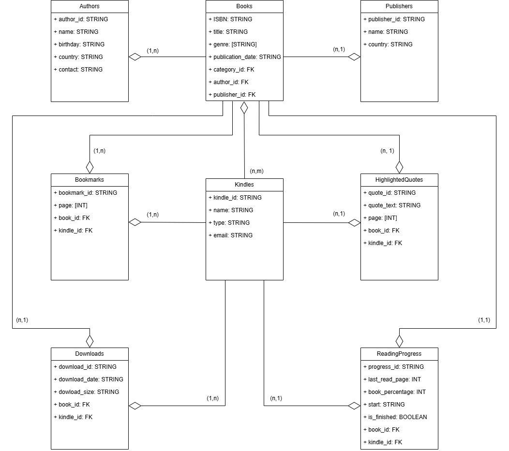

# Kindle Devices Management App

This is a Laravel Breeze project designed to manage Kindle devices and their libraries. The application provides functionalities to manage Kindles, their associated books, authors, publishers, bookmarks, highlighted quotes, downloads, and reading progress.

## Features

- Manage Kindle devices
- Manage books and their metadata (title, genre, publication date, etc.)
- Manage authors and publishers
- Track bookmarks and highlighted quotes
- Track downloads and their details
- Track reading progress

## UML Diagram

The following UML diagram provides an overview of the data model and relationships within the application:



## Getting Started

To get started with the project, follow these steps:

### Prerequisites

- PHP >= 8.0
- Composer
- Node.js & npm

### Installation

1. Clone the repository:
    ```bash
    git clone https://github.com/your-username/kindle-management-app.git
    cd kindle-management-app
    ```

2. Install dependencies:
    ```bash
    composer install
    npm install
    ```

3. Copy the `.env.example` file to `.env` and configure your environment variables:
    ```bash
    cp .env.example .env
    ```

4. Generate the application key:
    ```bash
    php artisan key:generate
    ```

5. Run migrations to set up the database:
    ```bash
    php artisan migrate
    ```

6. Start the development server:
    ```bash
    php artisan serve
    ```

## Models and Relationships

The application consists of the following models and their relationships:

- **Authors**
  - `author_id`: STRING
  - `name`: STRING
  - `birthday`: STRING
  - `country`: STRING
  - `contact`: STRING

- **Books**
  - `ISBN`: STRING
  - `title`: STRING
  - `genre`: ARRAY
  - `publication_date`: STRING
  - `author_id`: FK
  - `publisher_id`: FK
  - `kindle_id`: FK

- **Publishers**
  - `publisher_id`: STRING
  - `name`: STRING
  - `country`: STRING

- **Bookmarks**
  - `bookmark_id`: STRING
  - `page`: ARRAY
  - `book_id`: FK
  - `kindle_id`: FK

- **Kindles**
  - `kindle_id`: STRING
  - `name`: STRING
  - `type`: STRING
  - `email`: STRING
  - `book_id`: FK

- **HighlightedQuotes**
  - `quote_id`: STRING
  - `quote_text`: STRING
  - `page`: ARRAY
  - `book_id`: FK
  - `kindle_id`: FK

- **Downloads**
  - `download_id`: STRING
  - `download_date`: STRING
  - `download_size`: STRING
  - `book_id`: FK
  - `kindle_id`: FK

- **ReadingProgress**
  - `progress_id`: STRING
  - `last_read_page`: INT
  - `book_percentage`: INT
  - `start`: STRING
  - `is_finished`: BOOLEAN
  - `book_id`: FK
  - `kindle_id`: FK

## Contributing

Contributions are welcome! Please fork the repository and submit a pull request.

## Contact

For any questions or inquiries, please contact [kodzukeds@gmail.com](mailto:kodzukeds@gmail.com).